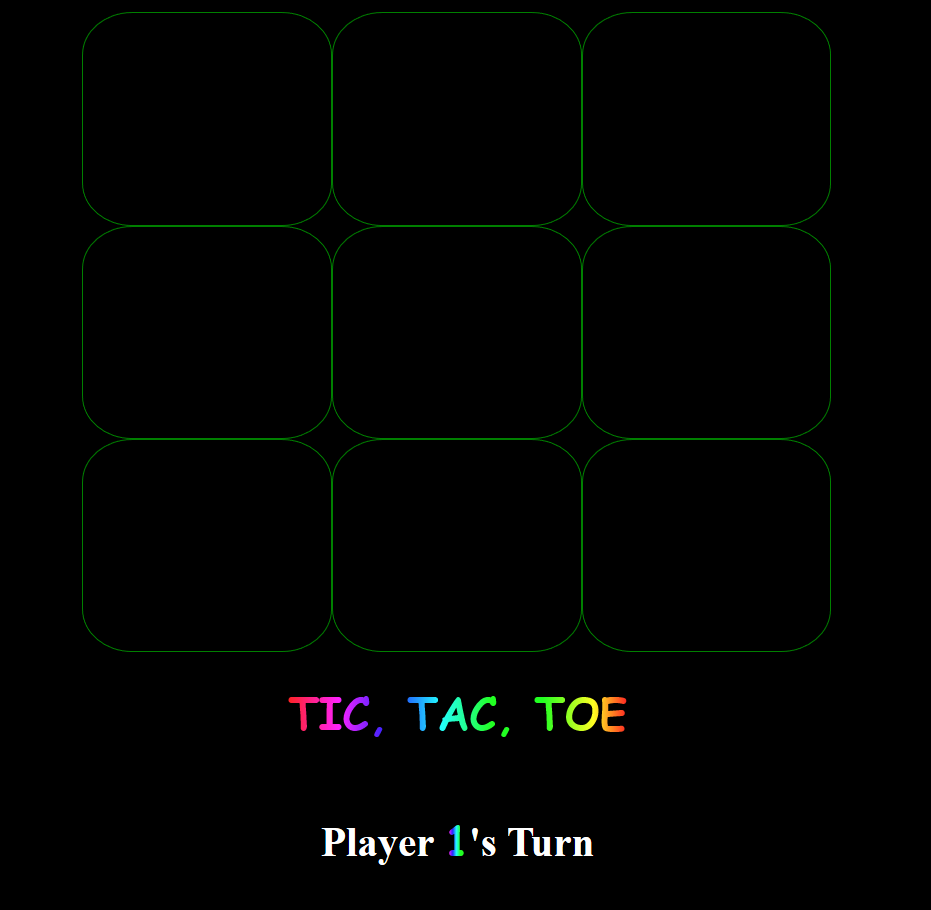

# ✅ Week07 Bootcamp2019 Project: TIC TAC TOE Game

### Goal: Build a tic-tac-toe game for two players

### How I did it
- Used HTML, CSS, JS
- Created nine sections inside of an overall section
- Created an array to track the node points of each box
- Created variables to keep track of the # of clicks and the player's turn
- Attached an event listener to the overall section so there's no need to do so for every one individually
- Upon each click, a function ran to increase the clicks counter, to change the text content of the chosen box, and to run a check for winners
- If somebody wins, an alert tells them they've won, otherwise, an alert activates at nine clicks if nbobody won
link: https://frosty-morse-04ba0c.netlify.com
